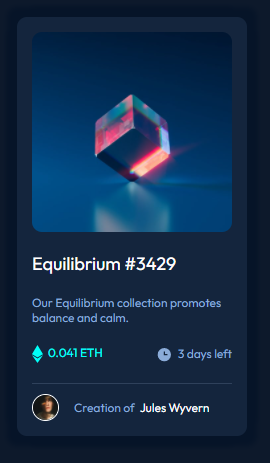

# Frontend Mentor - NFT preview card component solution

This is a solution to the [NFT preview card component challenge on Frontend Mentor](https://www.frontendmentor.io/challenges/nft-preview-card-component-SbdUL_w0U). Frontend Mentor challenges help you improve your coding skills by building realistic projects. 

## Table of contents

- [Overview](#overview)
  - [The challenge](#the-challenge)
  - [Screenshot](#screenshot)
  - [Links](#links)
- [My process](#my-process)
  - [Built with](#built-with)
  - [What I learned](#what-i-learned)
  - [Useful resources](#useful-resources)
- [Author](#author)


## Overview

### The challenge

Users should be able to:

- View the optimal layout depending on their device's screen size
- See hover states for interactive elements

### Screenshot




### Links

- Solution URL: [https://github.com/Hade21/NFT-preview-card-component]
- Live Site URL: [https://hade21.github.io/NFT-preview-card-component/]

## My process

### Built with

- HTML5 markup
- CSS custom properties
- Flexbox
- Mobile-first workflow


### What I learned


```html
<div class="container-img">
      
      <div class="middle">
        <div class="text"></div>
      </div>
    </div>
```
```css
.container-img {
    position: relative;
    cursor: pointer;
  }
  
.image {
    opacity: 1;
    display: block;
    width: 100%;
    border-radius: 10px;
    height: auto;
    transition: .5s ease;
    backface-visibility: hidden;
  }
  
.middle {
    transition: .5s ease;
    opacity: 0;
    position: absolute;
    top: 50%;
    left: 50%;
    transform: translate(-50%, -50%);
    -ms-transform: translate(-50%, -50%);
}

.container-img:hover .middle {
    opacity: 1;
}


### Useful resources

- [Example resource 1](https://www.w3school.com) - This helped me for XYZ reason. I really liked this pattern and will use it going forward.


## Author

- LinkedIn - (https://www.linkedin.com/in/muhammad-a-589675141/)
- Frontend Mentor - [@Hade21](https://www.frontendmentor.io/profile/Hade21)

